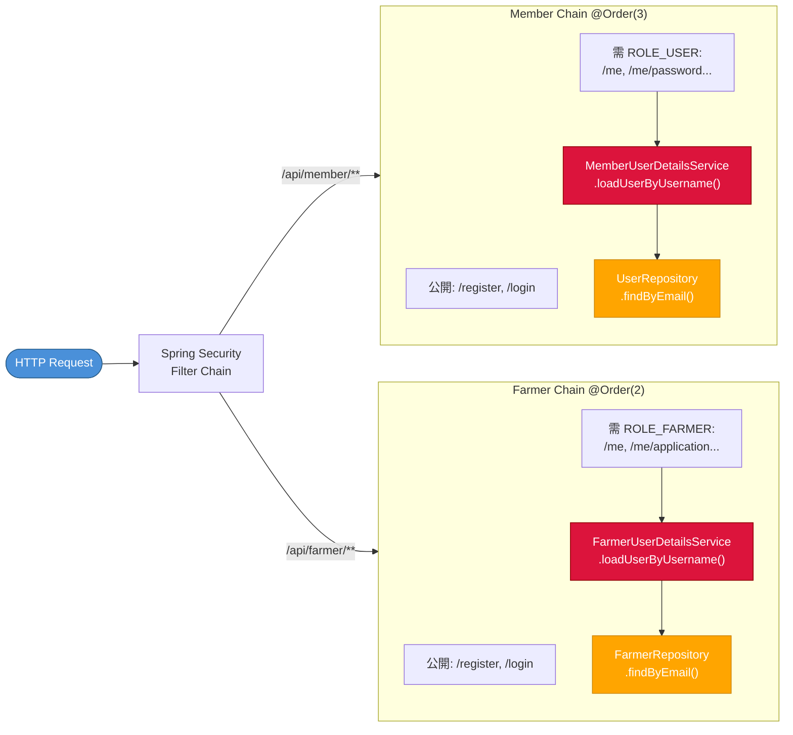

# Farmily User Service — 方法呼叫關係圖

> 本文件由 Claude Code 自動分析產生，涵蓋 User flow 與 Farmer flow 兩條主線。  
> 使用 Mermaid 語法，可在 Obsidian / VS Code（安裝 Markdown Preview Mermaid Support）直接預覽。

---

## 一、User（會員）Flow

```mermaid
flowchart TD
    %% ── HTTP 入口 ──
    R1([POST /api/member/register])
    R2([POST /api/member/login])
    R3([GET  /api/member/me])
    R4([PUT  /api/member/me])
    R5([PUT  /api/member/me/password])
    R6([DELETE /api/member/me])

    %% ── Controller ──
    UC_register["UserController.register()"]
    UC_login["UserController.login()"]
    UC_getMe["UserController.getMe()"]
    UC_update["UserController.updateMe()"]
    UC_changePw["UserController.changePassword()"]
    UC_delete["UserController.deleteMe()"]

    %% ── Service ──
    US_register["UserServiceImpl.register()"]
    US_login["UserServiceImpl.login()"]
    US_getProfile["UserServiceImpl.getMyProfile()"]
    US_update["UserServiceImpl.updateMyProfile()"]
    US_changePw["UserServiceImpl.changePassword()"]
    US_delete["UserServiceImpl.deleteUser()"]

    %% ── Security ──
    MUDS["MemberUserDetailsService\n.loadUserByUsername()"]
    MUD_new["new MemberUserDetails(user)"]

    %% ── Repository ──
    UR_findEmail["UserRepository\n.findByEmail()"]
    UR_findById["UserRepository\n.findById()"]
    UR_save["UserRepository\n.save()"]
    UR_existsById["UserRepository\n.existsById()"]
    UR_deleteById["UserRepository\n.deleteById()"]
    CDR_findById["CityDistrictRepository\n.findById()"]

    %% ── DTO ──
    UPR_from["UserProfileResponse.from(user)"]

    %% ── Util ──
    PE_encode["PasswordEncoder.encode()"]
    PE_matches["PasswordEncoder.matches()"]

    %% ── 連線：HTTP → Controller ──
    R1 --> UC_register
    R2 --> UC_login
    R3 --> UC_getMe
    R4 --> UC_update
    R5 --> UC_changePw
    R6 --> UC_delete

    %% ── register 鏈 ──
    UC_register --> US_register
    US_register --> UR_findEmail
    US_register --> CDR_findById
    US_register --> PE_encode
    US_register --> UR_save
    US_register --> UPR_from

    %% ── login 鏈 ──
    UC_login --> US_login
    US_login --> UR_findEmail
    US_login --> PE_matches
    US_login --> UPR_from
    UC_login --> MUDS
    MUDS --> UR_findEmail
    MUDS --> MUD_new

    %% ── getMe 鏈 ──
    UC_getMe --> US_getProfile
    US_getProfile --> UR_findById
    US_getProfile --> UPR_from

    %% ── updateMe 鏈 ──
    UC_update --> US_update
    US_update --> UR_findById
    US_update --> CDR_findById
    US_update --> UR_save
    US_update --> UPR_from

    %% ── changePassword 鏈 ──
    UC_changePw --> US_changePw
    US_changePw --> UR_findById
    US_changePw --> PE_matches
    US_changePw --> PE_encode
    US_changePw --> UR_save

    %% ── deleteMe 鏈 ──
    UC_delete --> US_delete
    US_delete --> UR_existsById
    US_delete --> UR_deleteById

    %% ── 樣式 ──
    classDef http    fill:#4a90d9,stroke:#2c5f8a,color:#fff
    classDef ctrl    fill:#7b68ee,stroke:#4b3abf,color:#fff
    classDef svc     fill:#50c878,stroke:#2e8b57,color:#fff
    classDef repo    fill:#ffa500,stroke:#cc8400,color:#fff
    classDef sec     fill:#dc143c,stroke:#8b0000,color:#fff
    classDef dto     fill:#708090,stroke:#404040,color:#fff
    classDef util    fill:#daa520,stroke:#8b6914,color:#000

    class R1,R2,R3,R4,R5,R6 http
    class UC_register,UC_login,UC_getMe,UC_update,UC_changePw,UC_delete ctrl
    class US_register,US_login,US_getProfile,US_update,US_changePw,US_delete svc
    class UR_findEmail,UR_findById,UR_save,UR_existsById,UR_deleteById,CDR_findById repo
    class MUDS,MUD_new sec
    class UPR_from dto
    class PE_encode,PE_matches util
```



---

## 二、Farmer（小農）Flow

```mermaid
flowchart TD
    %% ── HTTP 入口 ──
    F1([POST /api/farmer/register])
    F2([POST /api/farmer/login])
    F3([GET  /api/farmer/me])
    F4([PUT  /api/farmer/me])
    F5([PUT  /api/farmer/me/application])
    F6([PUT  /api/farmer/me/password])

    %% ── Controller ──
    FC_register["FarmerController.register()"]
    FC_login["FarmerController.login()"]
    FC_getMe["FarmerController.getMe()"]
    FC_update["FarmerController.updateContactInfo()"]
    FC_resubmit["FarmerController.resubmit()"]
    FC_changePw["FarmerController.changePassword()"]

    %% ── Service ──
    FS_register["FarmerServiceImpl.register()"]
    FS_login["FarmerServiceImpl.login()"]
    FS_getProfile["FarmerServiceImpl.getMyProfile()"]
    FS_update["FarmerServiceImpl.updateContactInfo()"]
    FS_resubmit["FarmerServiceImpl.resubmit()"]
    FS_changePw["FarmerServiceImpl.changePassword()"]

    %% ── Service private ──
    FS_findFarmer["FarmerServiceImpl\n.findFarmer()"]
    FS_findDistrict["FarmerServiceImpl\n.findDistrict()"]
    FS_newReview["FarmerServiceImpl\n.newReviewSnapshot()"]
    FS_toResponse["FarmerServiceImpl\n.toResponse()"]

    %% ── Security ──
    FUDS["FarmerUserDetailsService\n.loadUserByUsername()"]
    FUD_new["new FarmerUserDetails(farmer)"]

    %% ── EmailUniqueness ──
    EUC["EmailUniquenessChecker\n.emailAvailable()"]
    UR_exists["UserRepository\n.existsByEmail()"]
    FR_exists["FarmerRepository\n.existsByEmail()"]
    AR_exists["AdminRepository\n.existsByAdminEmail()"]

    %% ── Repository ──
    FR_findEmail["FarmerRepository\n.findByEmail()"]
    FR_findById["FarmerRepository\n.findById()"]
    FR_save["FarmerRepository\n.save()"]
    FRR_findTop["FarmerReviewRepository\n.findTopByFarmerIdOrderByRoundDesc()"]
    FRR_save["FarmerReviewRepository\n.save()"]
    CDR_findById["CityDistrictRepository\n.findById()"]

    %% ── DTO ──
    FPR_from["FarmerProfileResponse.from(farmer, review)"]

    %% ── Util ──
    PE_encode["PasswordEncoder.encode()"]
    PE_matches["PasswordEncoder.matches()"]

    %% ── 連線：HTTP → Controller ──
    F1 --> FC_register
    F2 --> FC_login
    F3 --> FC_getMe
    F4 --> FC_update
    F5 --> FC_resubmit
    F6 --> FC_changePw

    %% ── register 鏈 ──
    FC_register --> FS_register
    FS_register --> FS_findDistrict
    FS_findDistrict --> CDR_findById
    FS_register --> EUC
    EUC --> UR_exists
    EUC --> FR_exists
    EUC --> AR_exists
    FS_register --> PE_encode
    FS_register --> FR_save
    FS_register --> FS_newReview
    FS_register --> FRR_save
    FS_register --> FS_toResponse

    %% ── login 鏈 ──
    FC_login --> FS_login
    FS_login --> FR_findEmail
    FS_login --> PE_matches
    FS_login --> FS_toResponse
    FS_toResponse --> FRR_findTop
    FS_toResponse --> FPR_from
    FC_login --> FUDS
    FUDS --> FR_findEmail
    FUDS --> FUD_new

    %% ── getMe 鏈 ──
    FC_getMe --> FS_getProfile
    FS_getProfile --> FS_findFarmer
    FS_findFarmer --> FR_findById
    FS_getProfile --> FS_toResponse

    %% ── updateContactInfo 鏈 ──
    FC_update --> FS_update
    FS_update --> FS_findFarmer
    FS_update --> FR_save
    FS_update --> FS_toResponse

    %% ── resubmit 鏈 ──
    FC_resubmit --> FS_resubmit
    FS_resubmit --> FS_findFarmer
    FS_resubmit --> FRR_findTop
    FS_resubmit --> FS_findDistrict
    FS_resubmit --> FS_newReview
    FS_resubmit --> FRR_save
    FS_resubmit --> FS_toResponse

    %% ── changePassword 鏈 ──
    FC_changePw --> FS_changePw
    FS_changePw --> FS_findFarmer
    FS_changePw --> PE_matches
    FS_changePw --> PE_encode
    FS_changePw --> FR_save

    %% ── 樣式 ──
    classDef http    fill:#4a90d9,stroke:#2c5f8a,color:#fff
    classDef ctrl    fill:#7b68ee,stroke:#4b3abf,color:#fff
    classDef svc     fill:#50c878,stroke:#2e8b57,color:#fff
    classDef svcpriv fill:#3cb371,stroke:#1a6b3a,color:#fff
    classDef repo    fill:#ffa500,stroke:#cc8400,color:#fff
    classDef sec     fill:#dc143c,stroke:#8b0000,color:#fff
    classDef check   fill:#ff69b4,stroke:#c1388e,color:#fff
    classDef dto     fill:#708090,stroke:#404040,color:#fff
    classDef util    fill:#daa520,stroke:#8b6914,color:#000

    class F1,F2,F3,F4,F5,F6 http
    class FC_register,FC_login,FC_getMe,FC_update,FC_resubmit,FC_changePw ctrl
    class FS_register,FS_login,FS_getProfile,FS_update,FS_resubmit,FS_changePw svc
    class FS_findFarmer,FS_findDistrict,FS_newReview,FS_toResponse svcpriv
    class FR_findEmail,FR_findById,FR_save,FRR_findTop,FRR_save,CDR_findById repo
    class UR_exists,FR_exists,AR_exists repo
    class FUDS,FUD_new sec
    class EUC check
    class FPR_from dto
    class PE_encode,PE_matches util
```



---

## 三、Security 認證鏈（共用）



---

## 四、流程摘要（文字版）

### 4.1 會員（User）各流程

| 流程 | HTTP | 經過的方法（依序） |
|------|------|-------------------|
| **註冊** | `POST /api/member/register` | `UserController.register()` → `UserServiceImpl.register()` → `UserRepository.findByEmail()`（重複檢查）→ `CityDistrictRepository.findById()` → `PasswordEncoder.encode()` → `UserRepository.save()` → `UserProfileResponse.from()` |
| **登入** | `POST /api/member/login` | `UserController.login()` → `UserServiceImpl.login()` → `UserRepository.findByEmail()` → `PasswordEncoder.matches()` → `MemberUserDetailsService.loadUserByUsername()` → `UserRepository.findByEmail()` → `new MemberUserDetails()` → `UserProfileResponse.from()` |
| **查看個人資料** | `GET /api/member/me` | `UserController.getMe()`（從 Security Context 取 `MemberUserDetails`）→ `UserServiceImpl.getMyProfile()` → `UserRepository.findById()` → `UserProfileResponse.from()` |
| **修改個人資料** | `PUT /api/member/me` | `UserController.updateMe()` → `UserServiceImpl.updateMyProfile()` → `UserRepository.findById()` → `CityDistrictRepository.findById()` → `UserRepository.save()` → `UserProfileResponse.from()` |
| **修改密碼** | `PUT /api/member/me/password` | `UserController.changePassword()` → `UserServiceImpl.changePassword()` → `UserRepository.findById()` → `PasswordEncoder.matches()`（舊密碼驗證）→ `PasswordEncoder.encode()` → `UserRepository.save()` |
| **刪除帳號** | `DELETE /api/member/me` | `UserController.deleteMe()` → `UserServiceImpl.deleteUser()` → `UserRepository.existsById()` → `UserRepository.deleteById()` |

---

### 4.2 小農（Farmer）各流程

| 流程 | HTTP | 經過的方法（依序） |
|------|------|-------------------|
| **申請成為小農** | `POST /api/farmer/register` | `FarmerController.register()` → `FarmerServiceImpl.register()` → `findDistrict()` → `CityDistrictRepository.findById()` → `EmailUniquenessChecker.emailAvailable()` → `UserRepository.existsByEmail()` / `FarmerRepository.existsByEmail()` / `AdminRepository.existsByAdminEmail()` → `PasswordEncoder.encode()` → `FarmerRepository.save()` → `newReviewSnapshot()` → `FarmerReviewRepository.save()` → `toResponse()` → `FarmerProfileResponse.from()` |
| **登入**（限 ACTIVE）| `POST /api/farmer/login` | `FarmerController.login()` → `FarmerServiceImpl.login()` → `FarmerRepository.findByEmail()` → `PasswordEncoder.matches()` → 狀態檢查（非 ACTIVE 拋例外）→ `toResponse()` → `FarmerReviewRepository.findTopByFarmerIdOrderByRoundDesc()` → `FarmerProfileResponse.from()` → `FarmerUserDetailsService.loadUserByUsername()` → `FarmerRepository.findByEmail()` → `new FarmerUserDetails()` |
| **查看個人資料** | `GET /api/farmer/me` | `FarmerController.getMe()` → `FarmerServiceImpl.getMyProfile()` → `findFarmer()` → `FarmerRepository.findById()` → `toResponse()` → `FarmerReviewRepository.findTopByFarmerIdOrderByRoundDesc()` → `FarmerProfileResponse.from()` |
| **修改聯絡資訊** | `PUT /api/farmer/me` | `FarmerController.updateContactInfo()` → `FarmerServiceImpl.updateContactInfo()` → `findFarmer()` → `FarmerRepository.findById()` → `FarmerRepository.save()` → `toResponse()` → `FarmerProfileResponse.from()` |
| **重新送審**（申請資料）| `PUT /api/farmer/me/application` | `FarmerController.resubmit()` → `FarmerServiceImpl.resubmit()` → `findFarmer()` → `FarmerRepository.findById()` → `FarmerReviewRepository.findTopByFarmerIdOrderByRoundDesc()`（取得當前 round）→ `findDistrict()` → `CityDistrictRepository.findById()` → `newReviewSnapshot()`（round+1，記錄快照）→ `FarmerReviewRepository.save()` → `toResponse()` → `FarmerProfileResponse.from()` |
| **修改密碼** | `PUT /api/farmer/me/password` | `FarmerController.changePassword()` → `FarmerServiceImpl.changePassword()` → `findFarmer()` → `FarmerRepository.findById()` → `PasswordEncoder.matches()`（舊密碼驗證）→ `PasswordEncoder.encode()` → `FarmerRepository.save()` |

---

### 4.3 EmailUniquenessChecker 說明

小農註冊時才呼叫，確保 email 在三張表中均不存在：

```
EmailUniquenessChecker.emailAvailable(email)
    ├─ UserRepository.existsByEmail(email)       → 若已存在 → throw IllegalStateException
    ├─ FarmerRepository.existsByEmail(email)     → 若已存在 → throw IllegalStateException
    └─ AdminRepository.existsByAdminEmail(email) → 若已存在 → throw IllegalStateException
```

> 注意：**會員（User）的 `register()`** 只查 `UserRepository.findByEmail()`，未使用 `EmailUniquenessChecker`，代表目前 User 註冊不做跨表唯一性驗證。

---

### 4.4 圖例說明

| 顏色 | 代表層級 |
|------|---------|
| 藍色 | HTTP 端點入口 |
| 紫色 | Controller 層 |
| 綠色（深）| Service public 方法 |
| 綠色（中）| Service private 輔助方法 |
| 橘色 | Repository 方法 |
| 紅色 | Spring Security 元件 |
| 粉色 | EmailUniquenessChecker |
| 灰色 | DTO 工廠方法 |
| 金色 | PasswordEncoder 工具 |

---

### 4.5 尚未實作的 Controller

下列 Controller 類別已建立但方法體為空，**不在本圖範圍內**：

- `AuthController` — OAuth 登入（未實作）
- `AdminController` — 管理員主控（未實作）
- `AdminUserController` — 管理員管理會員（未實作）
- `AdminFarmerController` — 管理員管理小農（未實作）
- `AdminReviewController` — 管理員審核小農申請（未實作）